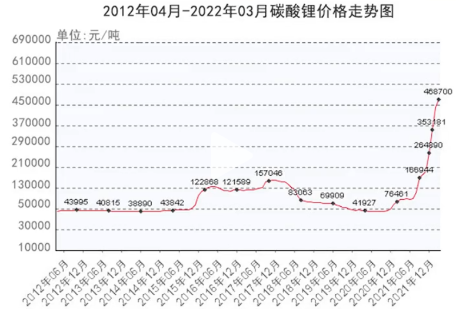
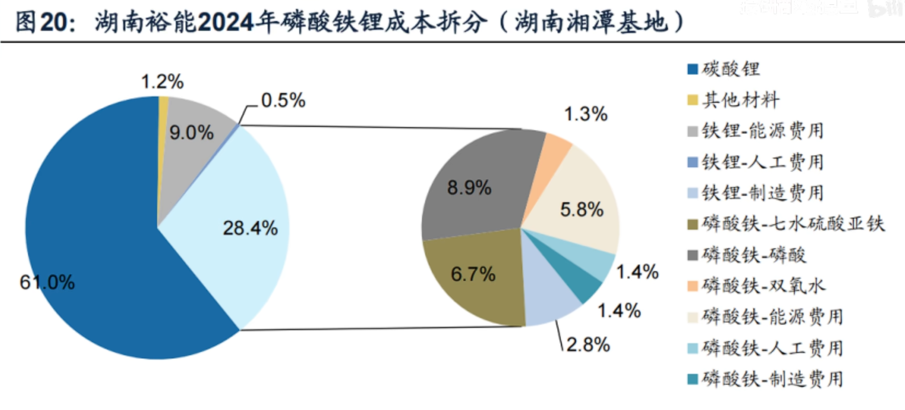
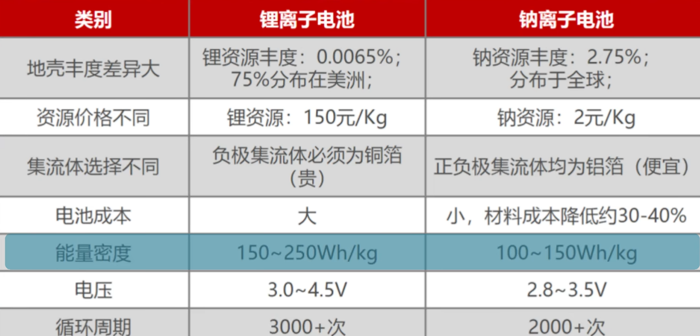
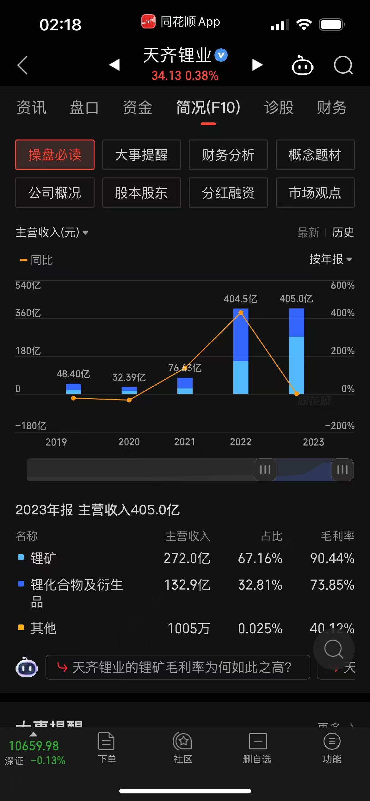
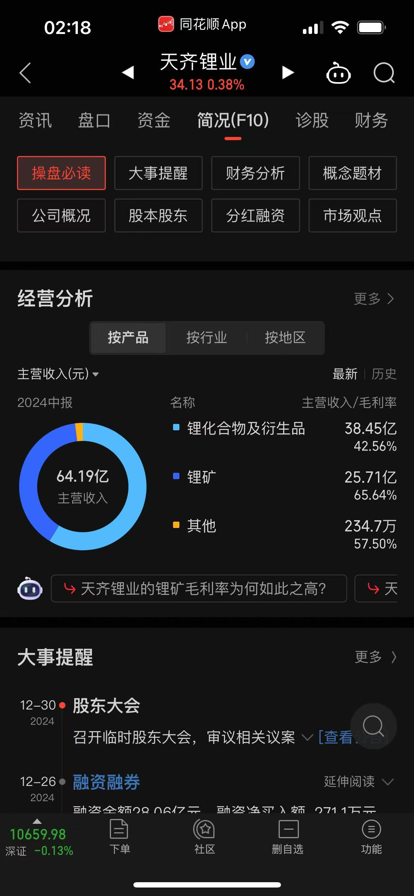

# 锂周期推导

Z哥您好，10月新粉。看您直播收获很大，受启发最近自己对锂期货做了一点研究，我觉得锂期货很类似20年石油的情况，未来期货和对应的原材料企业可能存在很大的盈利空间，于是在这个基础上收集数据做了一些分析。想看看您的意见。

因为b站规则，我只能给您发一条消息且不能发图片，所以只能发链接了。
细节（不知道b站会不会屏蔽）：https://docs.qq.com/pdf/DZFNtWWhCRnp0cFht。
如果看不了，您回复我一下，我给您发图片

本文主要对当前是否是锂周期的末尾进行了分析，主要因素包括：历史价格、制造成本、需求情况、未来产能发展和现状分析

## 关键信息

1. （历史价格）碳酸锂期货价格从 30-40W 跌到 7.8W 一吨
2. (需求情况)电池是锂需求的主要来源：折旧大概更换期在 1-3 年

   1. 电池以锂电池为主要来源
   2. 碳酸锂是锂电池成本本的最重要来源
   3. 锂元素的替代产品差距过大：Na 电池
      1. 优势：能量大约在 2/5-2/3 之间\*2/3=4/15-4/9--->续航距离 2-3 倍
      2. 劣势: 价格大约在 150：2，贵七十五倍

3. （制造成本）碳酸锂的成本

   1. 成本：原材料：5.2W+折旧等人工=大于 7W[[周线级别突破！碳酸锂反转了吗？](https://baijiahao.baidu.com/s?id=1815740542791103991&wfr=spider&for=pc)]
      1. 盐湖提锂 成本大约在 3W-5W
      2. 矿石提锂：成平均大于 7W ，大约在 6-17W 之间

4. （需求情况）市场供需

   1. 需求 30%的增长、每年，预计 2025 年大于 120W 吨
   2. （产能发展）供给：
      1. 盐湖：成本低于期货价格，今年 43W 吨，成长率 15%
      2. 矿石提取：高于期货价格，今年 77W 吨，成长率 15%
   3. 现状分析：
      1. 全球碳酸锂需求量接近 100 万吨，产量超过 110 万吨，过剩量约为 12 万吨（主要的下跌原因）
      2. 开矿成本高于 8W/吨的可能无法投产
         1. 赣锋锂业主要以矿石提锂为主，毛利从 56%跌倒 10%左右。实际净利润处于亏损
         2. 天齐锂业，以矿石和盐湖提锂结合，毛利从 70-90%跌到 40-60%，同样处于实际亏损中。

5. 结论

   1. （需求稳定）碳酸锂的需求市场稳定：电子产品、新能源车。纳电池暂时没有能取得代替的基础技术支持---这是与生猪等期货不同的一点
   2. （历史存在高价）碳酸锂的价格过去三年一直下跌，当前期货价格在大部分锂原材料厂商的成本价格左右。市场处于出清阶段
   3. （现状解析）当前处于消化库存阶段，期货价格低。这导致矿石提锂（市场中主要锂材料的来源）很多厂家有停工、减产的需求

      1. 这些厂家是在碳酸锂期货在 10W-20W 以上才能逐步盈利的，大部分原材料厂商进入市场也是在碳酸锂期货的高位时期

   4. （未来预计）出清结束带来的巨大缺口将导致下一个周期内，碳酸锂的供给缺口有很大概率放大，直到碳酸锂期货的价格回到高位。原因如下：

      1. 低成本的开采方式：盐湖提取的厂商很难涵盖市面上的锂需求的增长：超过 15%的缺口
      2. 市场制造有滞后性：等到锂价格开始恢复正常，到这部分厂商开工，以及锂进入市场，将存在时间差。这部分的时间差，会导致锂价格的加速抬升。
      3. 类比 2020 年石油市场有过类似的现象，石油自熔断时：价格从 500 下降到 200，在底部周期度过后迅速抬升至 800.这中间有可能存在超过 400%的利润空间。

6. 相关投资空间

   1. 锂期货
   2. 锂原材料公司：
      1. 西藏珠峰、西藏矿业、藏格矿业、盐湖股份： 以盐湖提锂为主要来源
      2. （本年亏损）天齐锂业、赣锋锂业等：以矿石提锂为主要来源

# Reference

当前和过去的碳酸锂走势

碳酸锂是锂电池的主要成分、成本来源

锂电池的替代品

调查代表企业： 天齐锂业
